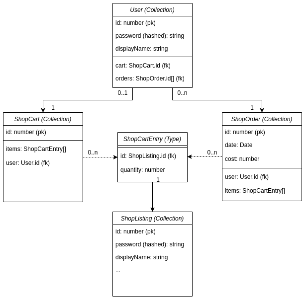

# Computer Parts Store

> An Express.js commerce site split into front and backend. Visit it
> [here](https://packet-loss-store.herokuapp.com/)!

## Package Management

For this project we are using the [yarn](https://yarnpkg.com/) package
manager. After cloning this project, type `yarn install` to install all
project dependencies.

To install a dependency, type `yarn add $PACKAGE_NAME`. Note: to specify
installation as a development dependency, use the `-D` argument. Eg.
`yarn add -D typescript`.

Alternatively, you can delete the `yarn.lock` file and run `npm install`
with the [npm](https://www.npmjs.com/) package manager.

## Coding Conventions

As we are using TypeScript for this project, we are going to be
following the conventions that have been set out within this
[styleguide](https://github.com/basarat/typescript-book/blob/master/docs/styleguide/styleguide.md).

## Project Structure

```bash
# Client
client/
    views/
        pages/
        partials/
    routes/

# Server
server/ 
    models/
    controller/
    middleware/
    routes/

# All
tests/
public/
```

## Database Schema

To handle the database logic of our application, we have chosen to work
with [MongoDB](https://www.mongodb.com/). For our instance, we have
chosen to use mongoDB Atlas as it allows all developers to share a
common instance of the database. The logic of how we have organised our
schemas should be unaffected if you choose to replicate this project
locally.

MongoDB behaves a bit differently to your typical Database service.
Instead of containing tables of fixed fields, the data is expressed and
stored by a JSON schema. Collections of these instances are known as a
`collection`. A single instance within a collection is known as a
`document`. By following this type of structure, this allows us to be
able to be more creative with how we index and store our data. Where
typical relationship databases cannot store collections of data, we can
define a JSON schema that can. What this means for our schema design is
that we do not need to save cart and order mappings to shop listing
items within a separate table. This is both more efficient and creates a
much simpler design.

For our structure our two main types of data sources are our `User` and
`ShopListing` collections. As this is an online commerce site, there is
naturally going to mappings between documents in these collections. For
our structure, we have chosen to create our mappings via two different
collections named `ShopCart` and `Order`. At a given time a `User` may
only have a single `ShopCart` of items and quantities, however it may
have any number of previous orders. It is critical that the user may not
update any previous orders, or any other users shopping cart. So instead
of providing the `User.id` within the request payload, it is important
to extract the `User.id` from the JWT payload to perform these
operations.

One thing to note, is that our `ShopCart` collection type does not have
the total price attribute. Our reasoning for this, as it is more dynamic
and prevents sync issues as it allows the total price to dynamically
update when the price of an individual `ShopListing` changes price. The
`Order` collection on the other hand will contain a price, as it is a
representation of an instance of a cart payment at a given time. When
the user makes a purchase, the price must never retrospectively change.



## Rest API

For the backend of this project we have developed a JSON based REST api.
This api is used natively by the client and is the sole interface for
interfacing with the backend model and data store. Unfortunately due to
time limitations, we were not able to create a full Swaggerhub of
documentation using OpenAPI. However, instead a copy of the
[postman](https://www.postman.com/) requests can be found within
[docs/postman](./docs/postman/postman-queries.json)

## Testing

Testing for this project is implemented using
[Mocha](https://mochajs.org/) + [Chai](https://www.chaijs.com/). To run
the tests execute `yarn run test`.

## Authors

| [](https://gitlab.ecs.vuw.ac.nz/scottzach1) | [](https://gitlab.ecs.vuw.ac.nz/cookharr) | [](https://gitlab.ecs.vuw.ac.nz/tonghoh) |
|:-----------------------------------------------------------------------------------------------------------------------------------|:-------------------------------------------------------------------------------------------------------------------------------------|:-----------------------------------------------------------------------------------------------------------------------------------------------|
| [Zac Scott](https://gitlab.ecs.vuw.ac.nz/scottzach1)                                                                               | [Harrison Cook](https://gitlab.ecs.vuw.ac.nz/cookharr)                                                                               | [Jeffrey Tong](https://gitlab.ecs.vuw.ac.nz/tonghoh)                                                                                           |
| 300447976                                                                                                                          | 300402048                                                                                                                            | 300417799                                                                                                                                      |

